# Minecraft Bingo
Be the first team to collect all required `items`, `mobs` and `advancements` to win the game!

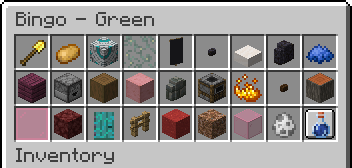<br>
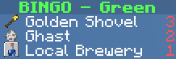<br>

Minecraft Bingo lets you and your friends play a game of bingo in Minecraft.
Players are divided into teams and must collect all randomly selected items, mobs and advancements to win.
The mod is highly configurable and can be adjusted to suit different playing styles.
The mod is designed to be played on a multiplayer server, but can also be played without a server.

## Getting Started
1. [Install Fabric](https://fabricmc.net/use/installer/)
2. Download [Fabric API](https://modrinth.com/mod/fabric-api) and put it in the mods folder
3. Download Minecraft Bingo from [Modrinth](TODO: link) and put it in the mods folder
4. (Optional - but highly recommended) Use the [Minecraft Bingo Resource Pack](https://github.com/170yt/Minecraft-Bingo-Resource-Pack)

## Commands
- `/bingo` or `/b` - Opens the bingo GUI, that shows all items to collect
- `/bingo teams` - Opens the team selection GUI
- `/bingo settings` - `OP` Opens the settings GUI
- `/bingo start` - `OP` Starts a new bingo game with the current settings
- `/bingo stop` - `OP` Stops the current bingo game
- `/bingo pause` - `OP` Pauses the current bingo game
- `/bingo resume` - `OP` Resumes the current bingo game
- `/bingo reset <suggested random string>` - `OP` Stops the server and resets the world with a new seed. The random string at the end is used to prevent accidental resets
- `/bingo useBingoResourcePack <true|false>` - `OP` Tells the game whether the players are using the resource pack or not
- `/top` - Teleports you to the surface (or to the world spawn if you are in the nether or the end)
- `/backpack` or `/bp` or `/ec` - Opens the team backpack

## Teams
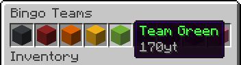<br>
Players can join a team by using the `/bingo teams` command.<br>
<details>
<summary>Team Management for OPs</summary>

Teams in Bingo are managed using the standard Minecraft team system. All teams used by Bingo are automatically created and managed by the mod (nine different teams are used).
OPs can use the vanilla `/team` command to manage the players in the teams. The following commands are available:
- `/team join <team> [<members>]` - `OP` Joins the specified team
- `/team leave <members>` - `OP` Leaves the team
</details>

## Settings
The settings are automatically saved between rounds so you do not have to reconfigure them every time.<br>
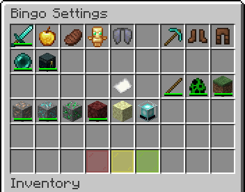<br>
All available settings from top left to bottom right:
- `PvP` - Enable player vs player combat
- `No Damage` - Players do not take damage
- `No Hunger` - Players do not lose hunger
- `Keep Inventory` - Keep inventory on death
- `Allow Flying` - Enable creative flight for all players
- `Block Break Speed` - Multiplier for block break speed
- `Movement Speed` - Multiplier for movement speed (including swimming)
- `Step Height` - Additional step height
- `Command Top` - Enable the `/top` command
- `Team Backpack` - Enable team backpacks (`/backpack`)
- `Goal Amount` - The amount of items, mobs and advancements each team needs to collect
- `Goal Type: Items` - Enable items as goals
- `Goal Type: Mobs` - Enable mobs as goals
- `Goal Type: Advancements` - Enable advancements as goals
- `Overworld Easy Pool` - Include easy goals from the overworld (see [Pools](#Overworld-Easy))
- `Overworld Medium Pool` - Include medium goals from the overworld (see [Pools](#Overworld-Medium))
- `Overworld Hard Pool` - Include hard goals from the overworld (see [Pools](#Overworld-Hard))
- `Nether Pool` - Include goals from the nether (see [Pools](#Nether))
- `End Pool` - Include goals from the end (see [Pools](#End))
- `Extreme Pool` - Include the hardest goals from all dimensions (see [Pools](#Extreme))
- `Stop Game` - Stops the current game and shows the leaderboard
- `Pause/Resume Game` - Pauses or resumes the current game
- `Start Game` - Starts a new game with the current settings

## Icons
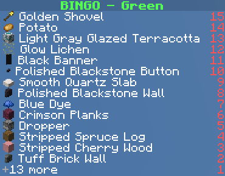<br>
The scoreboard can display icons for each goal. For this to work, the player (client) needs to have the resource pack installed.
The server can be configured to prompt the player to download the resource pack when they join the server.
I uploaded the resource pack to [mc-packs.net](https://download.mc-packs.net/pack/981e01d05e7bb0527592803efddfc3485bbd8a19.zip).
To use it, add the following lines to the server.properties file:
```
resource-pack=https://download.mc-packs.net/pack/4d20d1635481eb40bf4ce0d7726468457374c917.zip
resource-pack-sha1=4d20d1635481eb40bf4ce0d7726468457374c917
```
The resource pack can also be downloaded from [Modrinth](.
A file with all mappings between item names and icons can be found [here](https://github.com/170yt/Minecraft-Bingo-Resource-Pack) and must be placed in `config/bingo/item_icon_mappings.json`.
All icons will be disabled if the mappings file is not provided.

## Images
<br>
The bingo goals inventory shows all items, mobs and advancements that need to be collected to win the game.
Mobs are shown with their spawn egg and advancements are shown with their item and an advancement background.
All goals have a tooltip that shows what to do.

<br>
Each goal type has a different icon in the scoreboard.
Items show their icon (Golden Shovel), mobs show their spawn egg (Ghast) and advancements show their item with an advancement background (Local Brewery).

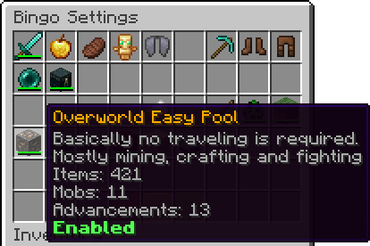<br>
Every pool shows a brief description and the amount of items, mobs and advancements it contains.

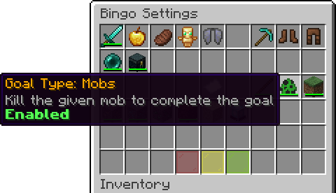<br>
Every goal type (Items, Mobs, Advancements) can be enabled or disabled.

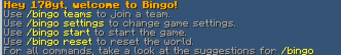<br>
The welcome message shows the most important commands to get started.

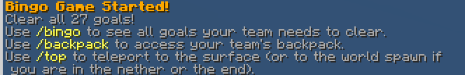<br>
The game started message shows the amount of goals and the most important commands to play the game.

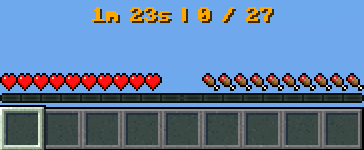<br>
The timer and score are displayed in the action bar.

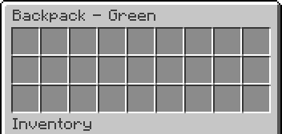<br>
The team backpack can be accessed by every team member using the `/backpack` command.

## Pools
Pools are used to group goals into different categories. Each pool contains a set of items, mobs and advancements that can be selected as goals.

### Overworld Easy
Requires little to no traveling and can be completed in a short amount of time.<br>
Most goals are related to mining, crafting and fighting.<br>
Includes: Coal, Iron, Copper

### Overworld Medium
Requires a decent amount of traveling and caving.<br>
Some trading might be helpful to complete the goals.<br>
Includes: Gold, Redstone, Emerald, Lapislazuli, Diamond

### Overworld Hard
Requires a lot of traveling.<br>
Includes: advanced Trading, Silk Touch, basic Nether, Bees

### Nether
Playable fully in the nether.<br>
Excludes extreme items, like nether stars and armor trims.

### End
Playable fully in the end.<br>
Starting gear is recommended for end only.

### Extreme
The hardest items from all dimensions.<br>
Includes: dyed Shulker Boxes, aged Copper Variants, Trial Chambers, Beacons

# FAQ
- **I see weird textures in the bingo goals inventory and the scoreboard. What can I do?**<br>
  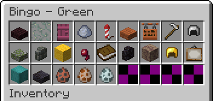<br>
  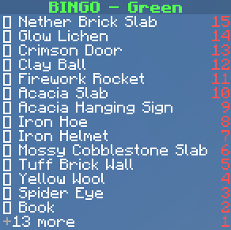<br>
  You need to install the [Minecraft Bingo Resource Pack](https://github.com/170yt/Minecraft-Bingo-Resource-Pack).<br>
  If you do not want to use the resource pack, you can disable the use of it with the command `/bingo useBingoResourcePack false` (you need to restart the server for this to take effect).
- **I cannot see the icons in the scoreboard. What can I do?**<br>
  Make sure that the item-icon mappings file is present (for instructions see [Minecraft Bingo Resource Pack](https://github.com/170yt/Minecraft-Bingo-Resource-Pack)).<br>
  Also, make sure that the setting `useBingoResourcePack` is set to `true`. You can see the current state with the command `/bingo useBingoResourcePack`.
- **Do I need to install the mod on the client side?**<br>
  No, the mod is server-side only and does not require the client to have it installed if it's already installed on the server.<br>
  The mod is designed to be played on a server with vanilla clients and does not require any client-side mods.
